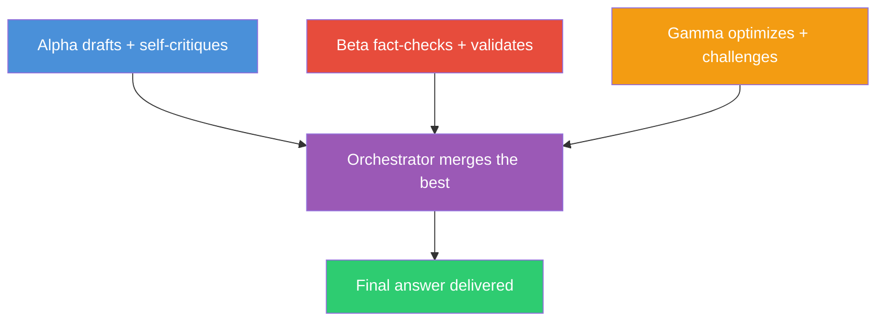

# LLM Council

A skill and agent for [GitHub Copilot CLI](https://docs.github.com/en/copilot/how-tos/copilot-cli/) that throws three different AI models at your problem in parallel — each tackling it independently from a different angle — then an orchestrator merges the best of all three into a single answer.

I call it the **Fast Triad** method. Three models, three perspectives, one final answer. Fast enough for daily use, thorough enough for decisions you'd regret getting wrong.

## What's this for?

This is a **[Copilot CLI](https://docs.github.com/en/copilot/how-tos/copilot-cli/)** extension. You need Copilot CLI installed and running. It won't work with regular GitHub Copilot in your editor — this is the terminal-based agent.

It gives you two things:
- A **skill** that triggers inside any Copilot CLI session (just type `council: your question`)
- A **standalone agent** you can run directly (`copilot --agent LLMCouncil`)

## Why three models?

Ask one model a question and you get one perspective. It'll sound confident even when it's wrong. It won't question its own assumptions. It definitely won't try to break its own argument.

Different models have different blind spots. Claude is good at nuance but might overcomplicate things. GPT might miss edge cases Claude catches. Gemini has strong grounding but different reasoning patterns. By giving each a dual role and running them all in parallel, you get diverse perspectives fast — without the overhead of sequential rounds.

The key insight: each agent does double duty. Alpha drafts AND red-teams itself. Beta validates AND fact-checks. Gamma optimizes AND plays devil's advocate. Then the orchestrator cherry-picks the best from each.

### The roles

| # | Codename | Job | Default Model | Fallback |
|---|----------|-----|---------------|----------|
| 1 | **Alpha** | Draft a thorough response + self-critique it | `claude-opus-4.6` | `gpt-5.2` |
| 2 | **Beta** | Independent fact-check + validation | `gpt-5.2` | `gemini-3-pro-preview` |
| 3 | **Gamma** | Optimize for clarity + play devil's advocate | `gemini-3-pro-preview` | `claude-opus-4.6` |
| 4 | **Orchestrator** | Merge all three into the final answer | `claude-opus-4.6` | `gpt-5.2` |

You can swap any of these models — edit the files to match what you have access to.

## How it works



1. **Parallel Triad** — Alpha, Beta, and Gamma all run simultaneously, each tackling the problem independently from their angle. Each does double duty (draft + critique)
2. **Orchestrate** — The orchestrator reads all three outputs, identifies consensus, resolves conflicts, and merges the strongest elements into a final answer. Unresolvable conflicts get flagged as caveats
3. **Ratify** — You get the result. By default you only see the final output. Add `verbose` to watch all three perspectives

## Prerequisites

- [GitHub Copilot CLI](https://docs.github.com/en/copilot/how-tos/copilot-cli/) installed and authenticated
- Access to multiple models through Copilot (the defaults use Claude, GPT, and Gemini)

## Install

```bash
git clone https://github.com/Sentry01/LLMCouncil.git
cd LLMCouncil

# Copy the skill
mkdir -p ~/.copilot/skills/llm-council
cp skills/llm-council/skill.md ~/.copilot/skills/llm-council/skill.md

# Copy the agent
mkdir -p ~/.copilot/agents
cp agents/LLMCouncil.agent.md ~/.copilot/agents/LLMCouncil.agent.md
```

No dependencies. No build. Just markdown files that Copilot CLI reads.

## Usage

### Inside a Copilot CLI session

Just use the keyword `council` (or `siege`, `swarm`, `multi-agent`):

```
council: Should we use a monorepo or polyrepo for our microservices?
```

### As a standalone agent

```bash
copilot --agent LLMCouncil "Review this auth flow for vulnerabilities"
```

### Seeing the debate

By default you only get the final answer. If you want to see what each agent said:

```
verbose council: What caching strategy for a real-time dashboard?
```

This shows all perspectives:
- 📝 Alpha (Draft + Self-Critique)
- ✅ Beta (Fact-Check + Validation)
- 🔧 Gamma (Optimized + Devil's Advocate)
- 🏛️ Orchestrated Verdict

## When to use it

**Worth it:**
- Architecture decisions you'll live with for years
- Security reviews (missed vulns are expensive)
- Research where you need verified facts
- Anything where being wrong costs more than 5 model calls

**Not worth it:**
- Quick fixes, file lookups, simple questions
- Anything where speed matters more than correctness
- Your model budget is tight (this uses 4 calls per question)

## Adapting to domains

The agents shift focus depending on what you're asking about:

| Domain | Alpha focuses on | Beta focuses on | Gamma focuses on |
|--------|-----------------|-----------------|------------------|
| Code | Implementation + security self-review | API accuracy, versions, edge cases | Performance, readability, alternatives |
| Architecture | System design + failure modes | Tech claims, benchmarks, scalability | Simplicity, clarity, alternatives |
| Research | Comprehensive analysis + bias check | Source verification, citations | Actionability, counter-arguments |
| Writing | Content + tone self-critique | Factual accuracy, consistency | Flow, conciseness, formatting |

## Example prompts

**Architecture:**
```
council: WebSockets + Redis pub/sub vs SSE + message queue for 10K concurrent users.
Cost, complexity, scaling, failure modes.
```

**Security:**
```
verbose council: Review this JWT implementation: [paste code]
```

**Research:**
```
council: Compare LoRA, QLoRA, and full fine-tuning for a 7B model with 50K examples.
Current best practices, realistic expectations.
```

## Inspiration

Inspired by Andrej Karpathy's [llm-council](https://github.com/karpathy/llm-council) — adapted as a Copilot CLI skill/agent with the Fast Triad architecture.

## License

MIT — do whatever you want with it.
