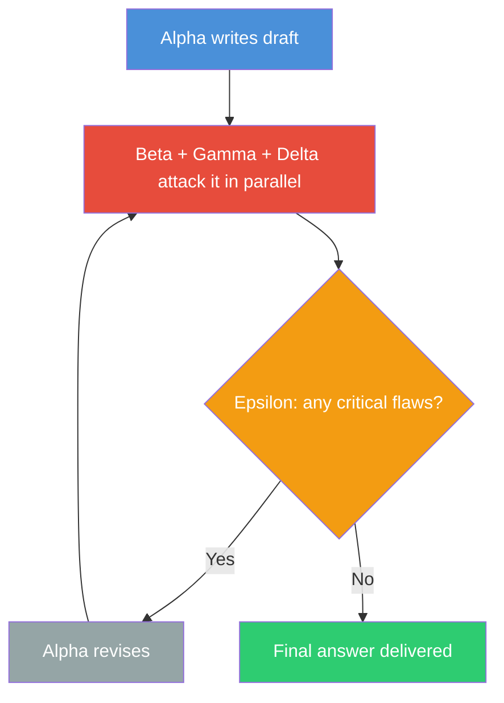

# LLM Council

A skill and agent for [GitHub Copilot CLI](https://docs.github.com/en/copilot/how-tos/copilot-cli/) that throws five different AI models at your problem — one writes the answer, three try to tear it apart, and the last one stitches together whatever survives.

I call it the **Parliamentary Siege** method. It's overkill for simple stuff, but for architecture calls, security reviews, or anything you'd regret getting wrong — it catches things no single model will.

## What's this for?

This is a **[Copilot CLI](https://docs.github.com/en/copilot/how-tos/copilot-cli/)** extension. You need Copilot CLI installed and running. It won't work with regular GitHub Copilot in your editor — this is the terminal-based agent.

It gives you two things:
- A **skill** that triggers inside any Copilot CLI session (just type `council: your question`)
- A **standalone agent** you can run directly (`copilot --agent LLMCouncil`)

## Why bother with 5 models?

Ask one model a question and you get one perspective. It'll sound confident even when it's wrong. It won't question its own assumptions. It definitely won't try to break its own argument.

Different models have different blind spots. Claude is good at nuance but might overcomplicate things. GPT might miss edge cases Claude catches. Gemini has strong grounding but different reasoning patterns. By giving each a specific adversarial role, you get something closer to how real decisions get made — through argument, not consensus.

Think of it like a courtroom. You wouldn't trust a trial where one person plays judge, prosecutor, defense, and witness. Same idea here.

### The five roles

| # | Codename | Job | Default Model |
|---|----------|-----|---------------|
| 1 | **Alpha** | Write the initial response. Be thorough. | `claude-opus-4.6` |
| 2 | **Beta** | Red team. Break the logic, find holes, argue against it. | `gpt-5.2` |
| 3 | **Gamma** | Fact-check. Verify every claim. Use search if needed. | `gemini-3-pro-preview` |
| 4 | **Delta** | Optimize. Is it clear? Well-structured? Actually usable? | `claude-sonnet-4` |
| 5 | **Epsilon** | Synthesize. Take the draft, the attacks, and produce the final answer. | `claude-opus-4.6` |

You can swap any of these models — edit the files to match what you have access to.

## How it works



1. **Draft** — Alpha writes a comprehensive first answer
2. **Siege** — Beta, Gamma, and Delta run in parallel, each attacking from their angle. They rate issues as CRITICAL, IMPORTANT, or MINOR
3. **Synthesize** — Epsilon reads everything. If there are critical flaws, Alpha revises and we go again (max 2 rounds). Otherwise, Epsilon merges the valid feedback into a final answer
4. **Ratify** — You get the result. By default you only see the final output. Add `verbose` to watch the whole debate

## Prerequisites

- [GitHub Copilot CLI](https://docs.github.com/en/copilot/how-tos/copilot-cli/) installed and authenticated
- Access to multiple models through Copilot (the defaults use Claude, GPT, and Gemini)

## Install

```bash
git clone https://github.com/Sentry01/LLMCouncil.git
cd LLMCouncil

# Copy the skill
mkdir -p ~/.copilot/skills/llm-council
cp skills/llm-council/skill.md ~/.copilot/skills/llm-council/skill.md

# Copy the agent
mkdir -p ~/.copilot/agents
cp agents/LLMCouncil.agent.md ~/.copilot/agents/LLMCouncil.agent.md
```

No dependencies. No build. Just markdown files that Copilot CLI reads.

## Usage

### Inside a Copilot CLI session

Just use the keyword `council` (or `siege`, `swarm`, `multi-agent`):

```
council: Should we use a monorepo or polyrepo for our microservices?
```

### As a standalone agent

```bash
copilot --agent LLMCouncil "Review this auth flow for vulnerabilities"
```

### Seeing the debate

By default you only get the final answer. If you want to see what each agent said:

```
verbose council: What caching strategy for a real-time dashboard?
```

This shows the full back-and-forth:
- 📝 Alpha's draft
- ⚔️ Beta's attack
- ✅ Gamma's fact-check
- 🔧 Delta's critique
- 🏛️ Final ratified answer

## When to use it

**Worth it:**
- Architecture decisions you'll live with for years
- Security reviews (missed vulns are expensive)
- Research where you need verified facts
- Anything where being wrong costs more than 5 model calls

**Not worth it:**
- Quick fixes, file lookups, simple questions
- Anything where speed matters more than correctness
- Your model budget is tight (this uses 5+ calls per question)

## Adapting to domains

The agents shift focus depending on what you're asking about:

| Domain | Beta looks for | Gamma checks | Delta critiques |
|--------|---------------|--------------|-----------------|
| Code | Security holes, race conditions | API accuracy, version numbers | Performance, readability |
| Architecture | Failure modes, scaling limits | Tech claims, benchmarks | Completeness, clarity |
| Research | Bias, bad methodology | Sources, citations | Whether it's actionable |
| Writing | Logic gaps, tone issues | Factual claims | Flow, brevity |

## Example prompts

**Architecture:**
```
council: WebSockets + Redis pub/sub vs SSE + message queue for 10K concurrent users.
Cost, complexity, scaling, failure modes.
```

**Security:**
```
verbose council: Review this JWT implementation: [paste code]
```

**Research:**
```
council: Compare LoRA, QLoRA, and full fine-tuning for a 7B model with 50K examples.
Current best practices, realistic expectations.
```

## License

MIT — do whatever you want with it.
