# Agent Council

A skill and agent for [GitHub Copilot CLI](https://docs.github.com/en/copilot/how-tos/copilot-cli/) that throws three different AI models at your problem in parallel — then either has them **build on each other's ideas** or **debate to stress-test the answer** — before an orchestrator delivers the final result.

Two modes, same foundation:
- **Collaborative** 🤝 (default) — Agents explore independently, read each other's work, improve their answers, then an orchestrator writes the best possible synthesis
- **Adversarial** 🗡️ — Agents draft independently, the orchestrator picks the strongest position, the others attack it, then a verdict is delivered

Fast enough for daily use. Thorough enough for decisions you'd regret getting wrong.

## What's this for?

This is a **[Copilot CLI](https://docs.github.com/en/copilot/how-tos/copilot-cli/)** extension. You need Copilot CLI installed and running. It won't work with regular GitHub Copilot in your editor — this is the terminal-based agent.

It gives you two things:
- A **skill** that triggers inside any Copilot CLI session (just type `council: your question`)
- A **standalone agent** you can run directly (`copilot --agent AgentCouncil`)

## Why three models?

Ask one model a question and you get one perspective. It'll sound confident even when it's wrong. It won't question its own assumptions. It definitely won't try to break its own argument.

Different models have different blind spots. Claude is good at nuance but might overcomplicate things. GPT might miss edge cases Claude catches. Gemini has strong grounding but different reasoning patterns. By running them all in parallel and then having them interact, you get something no single model can produce alone.

The key insight: **the mode determines how they interact.**
- In collaborative mode, they steal each other's best ideas and the result is a novel synthesis
- In adversarial mode, they attack the strongest position and the result is a battle-tested answer

### The roles

| # | Codename | Collaborative Role | Adversarial Role | Default Model | Fallback |
|---|----------|--------------------|------------------|---------------|----------|
| 1 | **Alpha** | Deep Explorer | Drafter & Red Teamer | `claude-opus-4.6` | `gpt-5.3-codex` |
| 2 | **Beta** | Practical Builder | Fact-Checker & Validator | `gpt-5.3-codex` | `gemini-3.1-pro` |
| 3 | **Gamma** | Elegant Minimalist | Optimizer & Devil's Advocate | `gemini-3.1-pro` | `claude-opus-4.6` |
| 4 | **Orchestrator** | Author (writes final synthesis) | Judge (delivers verdict) | `claude-opus-4.6` | `gpt-5.3-codex` |

You can swap any of these models — edit the files to match what you have access to.

## How it works

### Collaborative Mode 🤝 (Default)

```mermaid
flowchart TD
    A1["💡 Alpha explores deeply"] & B1["🔨 Beta grounds practically"] & C1["✨ Gamma finds elegance"]
    A1 & B1 & C1 --> X["Each reads the others' work"]
    X --> A2["Alpha improves"] & B2["Beta improves"] & C2["Gamma improves"]
    A2 & B2 & C2 --> D["🌟 Orchestrator writes final synthesis"]
    D --> E["Final answer delivered"]

    style A1 fill:#4a90d9,color:#fff
    style B1 fill:#e74c3c,color:#fff
    style C1 fill:#f39c12,color:#fff
    style A2 fill:#4a90d9,color:#fff
    style B2 fill:#e74c3c,color:#fff
    style C2 fill:#f39c12,color:#fff
    style D fill:#9b59b6,color:#fff
    style E fill:#2ecc71,color:#fff
```



1. **Draft** — Alpha, Beta, and Gamma all explore the problem independently from their angle
2. **Improve** — Each agent reads the other two drafts and writes an improved version, stealing the best ideas
3. **Synthesize** — The orchestrator authors the definitive response from all three enriched perspectives

### Adversarial Mode 🗡️

```mermaid
flowchart TD
    A1["📝 Alpha: thorough draft + self-critique weaknesses"] & B1["✅ Beta: independent solution + fact-check claims"] & C1["🔧 Gamma: elegant alternative + devil's advocate"]
    A1 & B1 & C1 --> T{"🎯 Orchestrator picks leader"}
    T -- "e.g. Alpha leads" --> ATK_B["⚔️ Beta attacks Alpha's position"]
    T -- "e.g. Alpha leads" --> ATK_C["⚔️ Gamma attacks Alpha's position"]
    ATK_B & ATK_C --> V["🏛️ Orchestrator delivers verdict"]
    V --> E["SURVIVED ✅ / MODIFIED 🔄 / OVERTURNED ❌"]

    style A1 fill:#4a90d9,color:#fff
    style B1 fill:#e74c3c,color:#fff
    style C1 fill:#f39c12,color:#fff
    style T fill:#9b59b6,color:#fff
    style ATK_B fill:#c0392b,color:#fff
    style ATK_C fill:#c0392b,color:#fff
    style V fill:#9b59b6,color:#fff
    style E fill:#2ecc71,color:#fff
```



1. **Draft** — Alpha, Beta, and Gamma all tackle the problem independently (same as collaborative)
2. **Triage** — The orchestrator identifies the strongest position. If consensus, skip to verdict.
3. **Attack** — The other two agents try to tear apart the leading position
4. **Verdict** — The orchestrator decides: did the leader survive, need modification, or get overturned?

## Prerequisites

- [GitHub Copilot CLI](https://docs.github.com/en/copilot/how-tos/copilot-cli/) installed and authenticated
- Access to multiple models through Copilot (the defaults use Claude, GPT, and Gemini)

## Install

```bash
git clone https://github.com/Sentry01/AgentCouncil.git
cd AgentCouncil

# Copy the skill
mkdir -p ~/.copilot/skills/agent-council
cp skills/agent-council/skill.md ~/.copilot/skills/agent-council/skill.md

# Copy the agent
mkdir -p ~/.copilot/agents
cp agents/AgentCouncil.agent.md ~/.copilot/agents/AgentCouncil.agent.md
```

No dependencies. No build. Just markdown files that Copilot CLI reads.

## Usage

### Mode detection

The council automatically detects which mode to use based on your language:

| You say... | Mode | Why |
|-----------|------|-----|
| `council: How should we structure the API?` | 🤝 Collaborative | Default — exploring a design space |
| `brainstorm: Novel approaches to caching` | 🤝 Collaborative | "brainstorm" = collaborative |
| `debate: Monorepo vs polyrepo` | 🗡️ Adversarial | "debate" = adversarial |
| `stress-test: Is this auth flow secure?` | 🗡️ Adversarial | "stress-test" = adversarial |
| `adversarial council: Should we use GraphQL?` | 🗡️ Adversarial | Explicit override |
| `collaborative council: Best testing strategy` | 🤝 Collaborative | Explicit override |

**Adversarial triggers:** debate, adversarial, challenge, stress-test, which is better, argue, attack, defend, versus, vs

**Collaborative triggers (default):** council, siege, swarm, brainstorm, collaborate, explore, build on, novel, creative, ideas

### Inside a Copilot CLI session

```
council: Should we use a monorepo or polyrepo for our microservices?
```

```
debate: Redis vs Memcached for our session store — which survives at scale?
```

### As a standalone agent

```bash
copilot --agent AgentCouncil "Brainstorm novel approaches to real-time sync"
```

```bash
copilot --agent AgentCouncil "Stress-test this auth flow for vulnerabilities"
```

### Seeing the internal process

By default you only get the final answer. If you want to see what each agent said:

```
verbose council: What caching strategy for a real-time dashboard?
```

**Collaborative verbose** shows:
- 💡 Alpha (Deep Explorer)
- 🔨 Beta (Practical Builder)
- ✨ Gamma (Elegant Minimalist)
- 📝 Improved versions after cross-pollination
- 🌟 Orchestrated Synthesis

**Adversarial verbose** shows:
- 📝 Alpha (Drafter & Red Teamer)
- ✅ Beta (Fact-Checker & Validator)
- 🔧 Gamma (Optimizer & Devil's Advocate)
- 🎯 Leading Position + ⚔️ Attacks
- 🏛️ Verdict (SURVIVED / MODIFIED / OVERTURNED)

## When to use each mode

### Collaborative 🤝 — when you want novel ideas

- Brainstorming sessions and creative problem-solving
- Exploring a design space with no clear "right answer"
- Building something new where diverse perspectives help
- Research where breadth and synthesis matter

### Adversarial 🗡️ — when you want battle-tested answers

- Architecture decisions you'll live with for years
- Security reviews (missed vulns are expensive)
- Comparing two specific approaches (A vs B)
- Anything where you need confidence the answer holds up under scrutiny

### Not worth it (either mode)

- Quick fixes, file lookups, simple questions
- Anything where speed matters more than correctness
- Your model budget is tight (collaborative uses 7 calls, adversarial uses 6)

## Cost & speed

| Mode | Subagent Calls | Parallel Rounds | Wall Clock |
|------|----------------|-----------------|------------|
| Collaborative | 7 (3 + 3 + orchestrator) | 2 | ~2 rounds |
| Adversarial | 6 (3 + 2 + orchestrator) | 2 | ~2 rounds |

Both modes run agents in parallel within each phase. The wall-clock time is roughly two sequential subagent calls, regardless of how many agents run in each round.

## Adapting to domains

The agents shift focus depending on what you're asking about:

| Domain | Alpha focuses on | Beta focuses on | Gamma focuses on |
|--------|-----------------|-----------------|------------------|
| Code | Implementation + security self-review | API accuracy, versions, edge cases | Performance, readability, alternatives |
| Architecture | System design + failure modes | Tech claims, benchmarks, scalability | Simplicity, clarity, alternatives |
| Research | Comprehensive analysis + bias check | Source verification, citations | Actionability, counter-arguments |
| Writing | Content + tone self-critique | Factual accuracy, consistency | Flow, conciseness, formatting |

## Example

Here's the council in action — Phase 1 dispatching all three agents in parallel across different model families:


## Example prompts

**Collaborative — brainstorming:**
```
council: Novel approaches to real-time collaboration in a document editor.
Think beyond CRDTs and OT.
```

**Collaborative — architecture:**
```
council: Design a notification system that scales to 1M users.
Push, pull, fan-out strategies.
```

**Adversarial — decision:**
```
debate: WebSockets + Redis pub/sub vs SSE + message queue for 10K concurrent users.
Cost, complexity, scaling, failure modes.
```

**Adversarial — security:**
```
verbose stress-test: Review this JWT implementation: [paste code]
```

**Adversarial — comparison:**
```
debate: PostgreSQL vs DynamoDB for a multi-tenant SaaS with unpredictable query patterns
```

## Inspiration

Inspired by Andrej Karpathy's [llm-council](https://github.com/karpathy/llm-council) — adapted as a Copilot CLI skill/agent with the dual-mode architecture.

## License

MIT — do whatever you want with it.
