# 🏛️ LLM Council

**Multi-model adversarial review for high-stakes AI outputs.**

LLM Council pits five AI models against each other — one drafts, three attack, one synthesizes — so you get answers that survive scrutiny instead of echo-chamber outputs from a single model.

[](LICENSE)

---

## 🧠 The Theory: Parliamentary Siege

A single LLM responds with one perspective. It has blind spots, biases, and no incentive to question itself. LLM Council fixes this with a method called **Parliamentary Siege** — a structured adversarial protocol inspired by how robust decisions actually get made: through opposition.

### Why multiple models?

**Cognitive diversity.** Different models are trained on different data, with different architectures and alignment strategies. GPT reasons differently than Claude. Gemini grounds differently than both. These aren't interchangeable — they have genuinely different strengths and failure modes.

A single model can confidently present flawed logic, hallucinated facts, or suboptimal structure and never catch itself. Multiple models *with different roles* catch what any single model misses.

### The courtroom analogy

Think of it like a trial:

- **The prosecution** (Red Teamer) actively tries to break the argument
- **The expert witness** (Fact-Checker) verifies every claim against evidence
- **The defense attorney** (Optimizer) ensures the argument is structured for maximum impact
- **The judge** (Synthesizer) weighs all perspectives and renders a verdict

No courtroom relies on one person playing all roles. Neither should your AI pipeline.

### Why exactly 5 roles?

Each role targets a distinct failure mode:

| Failure Mode | Council Member | Without It |
|---|---|---|
| Shallow thinking | **Generator** creates depth | Quick answers miss nuance |
| Logical flaws | **Red Teamer** attacks reasoning | Bad logic ships unchallenged |
| Hallucinated facts | **Fact-Checker** verifies claims | False information presented as truth |
| Poor usability | **Optimizer** critiques structure | Correct answers that nobody can follow |
| Contradictory feedback | **Synthesizer** resolves conflicts | Reviewers cancel each other out |

Fewer roles leave gaps. More roles hit diminishing returns. Five is the sweet spot.

---

## 👥 The Five Council Members

| Role | Codename | Focus | Default Model |
|---|---|---|---|
| 🖊️ **Generator** | Alpha | Depth, nuance, comprehensive first draft | `claude-opus-4.6` |
| ⚔️ **Red Teamer** | Beta | Break logic, find vulnerabilities, counter-arguments | `gpt-5.2` |
| ✅ **Fact-Checker** | Gamma | Grounding, accuracy, real-world validity | `gemini-3-pro-preview` |
| 🔧 **Optimizer** | Delta | Efficiency, structure, clarity, UX | `claude-sonnet-4` |
| 🏛️ **Synthesizer** | Epsilon | Merge all feedback into final ratified output | `claude-opus-4.6` |

Models are recommended defaults. Swap them based on task domain and availability.

---

## 🔄 The Protocol

```mermaid
flowchart TD
    A["📝 Phase 1: DRAFT\nAlpha generates comprehensive response"] --> B["⚔️ Phase 2: SIEGE\nBeta + Gamma + Delta review in parallel"]
    B --> C{"🏛️ Phase 3: SYNTHESIZE\nEpsilon evaluates all input"}
    C -->|"CRITICAL flaws found"| D["🔁 Alpha revises draft"]
    D --> B
    C -->|"No critical flaws"| E["✅ Phase 4: RATIFY\nFinal output delivered to user"]

    style A fill:#4a90d9,color:#fff
    style B fill:#e74c3c,color:#fff
    style C fill:#f39c12,color:#fff
    style D fill:#95a5a6,color:#fff
    style E fill:#2ecc71,color:#fff
```



**Draft → Siege → Synthesize → Ratify.** If critical flaws surface, the loop repeats (max 2 rounds), then ratifies with caveats.

---

## 📦 Installation

LLM Council is a [GitHub Copilot Extension](https://docs.github.com/en/copilot/customizing-copilot) — a skill + agent pair you drop into your Copilot configuration.

### 1. Clone the repo

```bash
git clone https://github.com/Sentry01/LLMCouncil.git
cd LLMCouncil
```

### 2. Copy the skill

```bash
mkdir -p ~/.copilot/skills/llm-council
cp skills/llm-council/skill.md ~/.copilot/skills/llm-council/skill.md
```

### 3. Copy the agent

```bash
mkdir -p ~/.copilot/agents
cp agents/LLMCouncil.agent.md ~/.copilot/agents/LLMCouncil.agent.md
```

That's it. No dependencies, no build step, no API keys beyond what Copilot already uses.

---

## 🚀 Usage

LLM Council has two entry points depending on how you want to work.

### In-session skill (inside any Copilot chat)

Trigger the council by using the keyword in your prompt:

```
council: Should we use a monorepo or polyrepo for our microservices platform?
```

Other trigger words: `siege`, `swarm`, `multi-agent`.

### Standalone agent

Run the dedicated Council agent directly:

```
copilot --agent LLMCouncil "Review this authentication flow for security vulnerabilities"
```

### Verbose mode (show the debate)

By default, you only see the final ratified output. To watch the full deliberation:

```
verbose council: What's the best caching strategy for our real-time dashboard?
```

Verbose output shows each phase with headers:

- 📝 **Alpha Draft** — The initial comprehensive response
- ⚔️ **Beta (Red Team)** — Logic attacks, vulnerabilities found
- ✅ **Gamma (Fact-Check)** — Claim verification results
- 🔧 **Delta (Optimizer)** — Structure and usability critique
- 🏛️ **Ratified Verdict** — The final synthesized output

---

## ⚙️ Configuration

### Model selection

The default model assignments are optimized for cognitive diversity across providers:

| Role | Default | Why |
|---|---|---|
| Alpha (Generator) | `claude-opus-4.6` | Strong at nuanced, comprehensive reasoning |
| Beta (Red Teamer) | `gpt-5.2` | Different training biases catch different flaws |
| Gamma (Fact-Checker) | `gemini-3-pro-preview` | Strong grounding and search integration |
| Delta (Optimizer) | `claude-sonnet-4` | Fast, practical structural critique |
| Epsilon (Synthesizer) | `claude-opus-4.6` | Needs deep reasoning to weigh conflicting input |

Edit the model values in `skill.md` and `LLMCouncil.agent.md` to swap providers.

### Domain adaptation

The council auto-detects task domain and adjusts each reviewer's focus:

| Domain | Beta Focus | Gamma Focus | Delta Focus |
|---|---|---|---|
| **Code** | Security, edge cases, race conditions | API accuracy, version correctness | Performance, readability, patterns |
| **Architecture** | Failure modes, scalability limits | Technology claims, benchmarks | Diagram clarity, completeness |
| **Research** | Bias, methodology flaws | Source verification, citations | Readability, actionability |
| **Writing** | Logical consistency, tone | Factual accuracy | Flow, conciseness, formatting |

### When to use (and when not to)

**Use Council for:**
- Architecture decisions with long-term consequences
- Security reviews where missed vulnerabilities matter
- Research synthesis where accuracy is critical
- Complex code that needs adversarial stress-testing

**Don't use Council for:**
- Simple one-line fixes
- File lookups or quick searches
- Tasks where speed matters more than depth
- Trivial questions (the protocol is expensive — 5+ model calls per task)

---

## 💡 Examples

### Architecture decision

```
council: We're building a real-time collaboration platform for 10K concurrent users.
Should we use WebSockets with Redis pub/sub, or Server-Sent Events with a message queue?
Consider cost, complexity, scaling, and failure modes.
```

The council will generate a thorough comparison, have it attacked for missing failure scenarios, fact-checked for benchmark claims, optimized for decision-readability, then deliver a battle-tested recommendation.

### Security review

```
verbose council: Review this JWT authentication implementation for security vulnerabilities:
[paste code]
```

Beta hunts for token leakage, replay attacks, and missing validation. Gamma verifies claims about algorithm security. Delta checks if the error handling is production-ready. You see the full debate.

### Research question

```
council: What are the current best practices for fine-tuning LLMs on domain-specific data?
Compare LoRA, QLoRA, and full fine-tuning for a 7B parameter model
with 50K training examples.
```

Gamma fact-checks benchmark numbers and paper citations. Beta challenges assumptions about dataset size sufficiency. Delta ensures the response is actionable for someone choosing today.

---

## 🔍 How It Works Internally

The protocol runs in four phases:

**Phase 1 — Draft.** A `general-purpose` subagent (Alpha) generates a comprehensive response using `claude-opus-4.6`. It's told to be thorough because its work will be attacked.

**Phase 2 — Siege.** Three subagents launch **in parallel**. Beta (Red Teamer) attacks logic and finds vulnerabilities. Gamma (Fact-Checker) verifies every claim, using web search when possible. Delta (Optimizer) critiques structure and usability. Each rates findings by severity: `CRITICAL`, `IMPORTANT`, or `MINOR`.

**Phase 3 — Synthesize.** Epsilon reads the draft and all three critiques. If any `CRITICAL` flaw was found, it returns `VERDICT: REVISE` with instructions. Alpha then revises and the siege reruns (max 2 rounds). If no critical flaws remain, Epsilon produces the final output incorporating all valid feedback.

**Phase 4 — Ratify.** The final output is presented to the user. In default mode, no internal process is visible. In verbose mode, every phase is shown.

---

## 📄 License

[MIT](LICENSE) — Use it, fork it, improve it.
